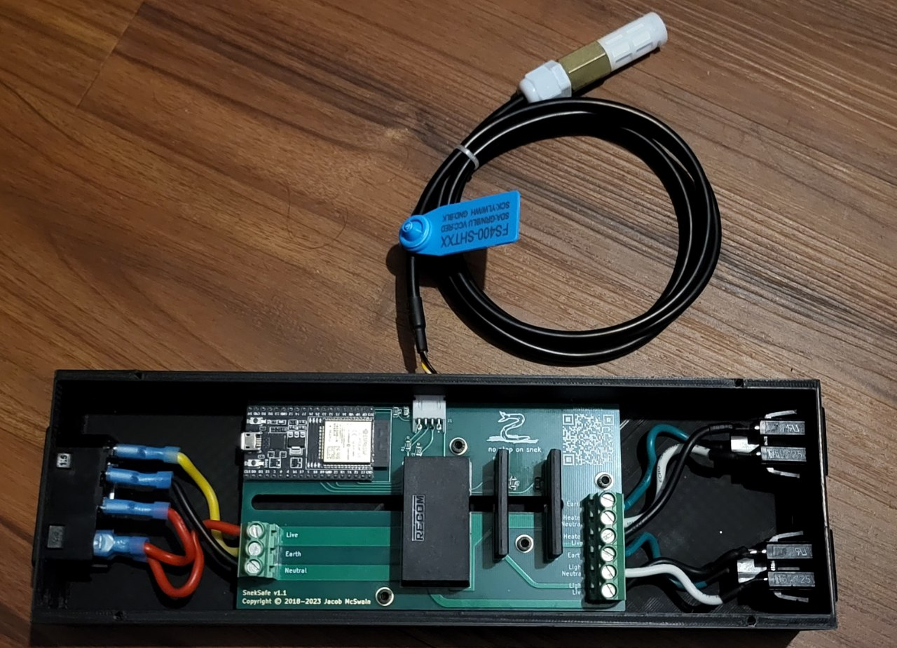
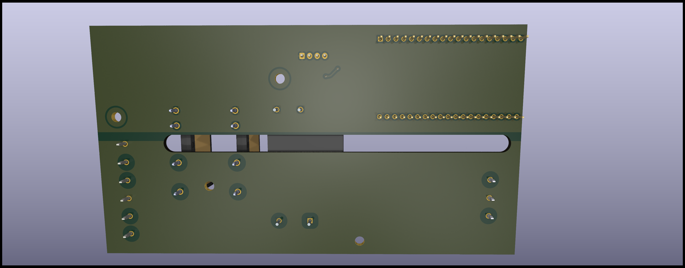

# SnekSafe

Keep your snek safe by controlling temperature and lighting.

## Assembled v1.1 Board

## Board Renders

## Schematic

## Board Layout

## Site Images

## Parts not in the BOM that you might need

- 14AWG Silicone Wire - <https://www.amazon.com/dp/B089CRKSNN>
- Spade connectors for 14AWG - <https://www.amazon.com/dp/B08BZ972B5>
- 24AWG 4-conductor wire - <https://www.amazon.com/dp/B0BYDTCZ61>
- JST XH crimpers
- Heat shrink
- A 3d printer

## Cost

The one-off BOM cost, assuming you have spade connectors and 14AWG wire on hand is $121.25.

## On ESP32 choice

I chose the official ESP32-DevKitC-32E (ESP32-DevKitC V4) board due to quality. For some reason, on a cheaper NodeMCU ESP32S I was able to scan less WiFi networks and got a lower effective range.

## Premade Carts

A few items, such as the C13 AC cord, the C14 AC plug, and the panel mount AC outlets must be sourced on your own, as DigiKey and Mouser don't sell these commonly.

### JST XH Plug Parts

Mouser doesn't stock these: <https://www.digikey.com/short/1hzrmn3b>

### Mouser

<https://www.mouser.com/ProjectManager/ProjectDetail.aspx?AccessID=c3308da5f2>
