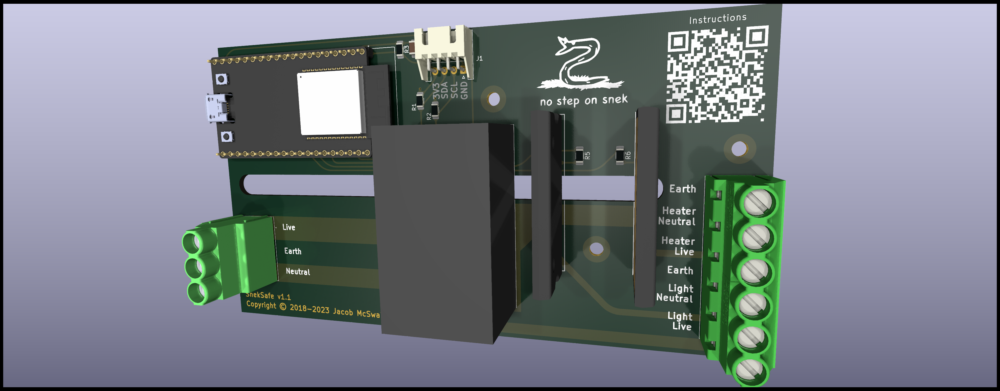

# SnekSafe

Keep your snek safe by controlling temperature and lighting.

## Assembled v1.1 Board

## Board Renders

## Schematic

## Board Layout

## Parts not in the BOM

- 14AWG Silicone Wire - https://www.amazon.com/dp/B089CRKSNN
- Spade connectors for 14AWG - https://www.amazon.com/dp/B08BZ972B5
- 24AWG 4-conductor wire - https://www.amazon.com/dp/B0BYDTCZ61
- JST XH crimpers
- JST XH connector
- Heat shrink - https://www.amazon.com/dp/B084GDLSCK
- 2x AC outlet sockets - https://www.amazon.com/dp/B09V27W6H6
- Any I2C temperature sensor @ 3.3v - https://www.digikey.com/en/products/detail/dfrobot/SEN0385/13590873
- AC C14 plug - https://www.amazon.com/dp/B0895T9NXF
- AC C13 cord - https://www.amazon.com/dp/B07KBDPH8X
- 10A 250v fuse - https://www.amazon.com/dp/B07WZFMXNS
- A 3d printer or shapeways
